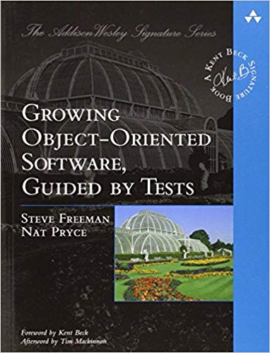

# TDD with OOP workshop

### Learn more

#### Read more

[Object callisthenics](https://williamdurand.fr/2013/06/03/object-calisthenics/) - set of code writing rules supporting clean code. 

#### Watch more

[Ian Cooper speaking on proper approach to TDD](https://www.youtube.com/watch?v=EZ05e7EMOLM)

[Similiar approach presented by Jakub Nabrdalik](https://www.youtube.com/watch?v=2vEoL3Irgiw)

[Excellent explanation of SOLID heuristics by Łukasz Szydło [PL]](https://www.google.com/url?sa=t&rct=j&q=&esrc=s&source=web&cd=1&cad=rja&uact=8&ved=2ahUKEwiIk5-E96flAhV-wcQBHTYsAMMQwqsBMAB6BAgJEAQ&url=https%3A%2F%2Fwww.youtube.com%2Fwatch%3Fv%3DTO3S_xePS4U&usg=AOvVaw1Mz_w-WsmvIzzZE8rFkQTn)

## Tools

[JUnit user guide](https://junit.org/junit5/docs/current/user-guide/)

[AssertJ home page](https://joel-costigliola.github.io/assertj/)

### 

